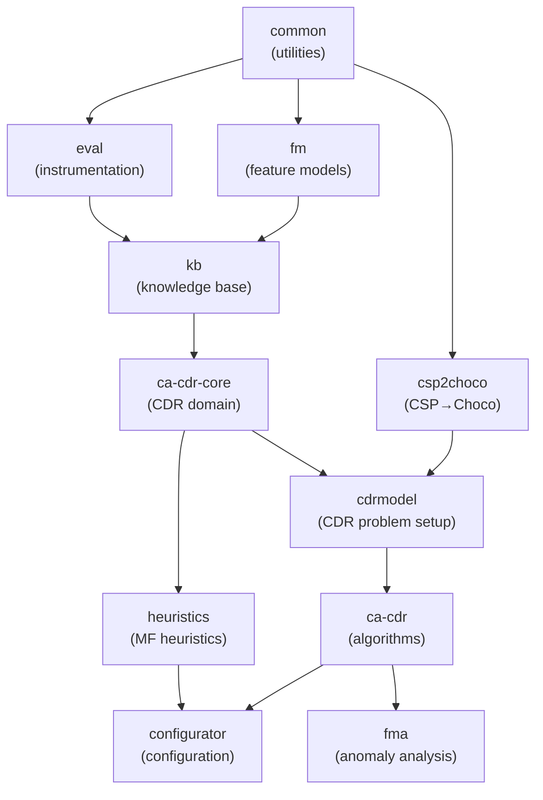

# HiConfiT-Core System Architecture

**Version:** 1.0.1-alpha-49 | **Date:** 2026-07-21 | **Branch:** dev | **Java:** 23 | **Build:** Maven

## Module Dependency Graph



**Module Dependency Table:**

| Module | Depends on (first-party) | Layer | Artifacts |
|--------|--------------------------|-------|-----------|
| common | — | Foundation | utilities, Choco integration |
| eval | common | Foundation | performance counters/timers |
| csp2choco | common | Parsing | CSP text → Choco Model |
| fm | common | Representation | 5 FM parsers, builder injection seam |
| kb | fm, eval | Representation | KB abstraction, FMKB, constraint duals |
| ca-cdr-core | kb | Core CDR | test cases, solutions, translators (SPI) |
| cdrmodel | ca-cdr-core, csp2choco | Core CDR | AbstractCDRModel, FM/KB specializations |
| ca-cdr | cdrmodel | Algorithms | 9 algorithms, 6 labelers, 2 pruning engines |
| heuristics | ca-cdr-core | Heuristics | Matrix Factorization VVO (dead from codebase) |
| configurator | ca-cdr, heuristics | Integration | knowledge-based configuration |
| fma | ca-cdr | Analysis | 6 anomaly analyses, 4-way symmetry pattern |

**Key Corrections to CLAUDE.md:**
1. `eval` depends on `common` (not dependency-free)
2. `csp2choco` enters at `cdrmodel` layer (not `kb`)
3. `heuristics` branches off `ca-cdr-core` directly (bypassing `cdrmodel`/`ca-cdr`)

---

## 8 Core Architectural Patterns

### 1. KB Abstraction Layer

**Contract:** 3 abstract methods form a template-method pattern.

```java
// At reset(hasNegativeConstraints):
modelKB = new Model();
variableList, domainList, constraintList = new LinkedList<>();
// then call:
defineDomains();         // (private in PCKB/RenaultKB/CameraKB; NOT in contract)
defineVariables();       // abstract
defineConstraints(...);  // abstract
```

**Files:** `kb/core/KB.java`, `kb/fm/FMKB.java`, `kb/pc/PCKB.java`, `kb/renault/RenaultKB.java`, `kb/camera/CameraKB.java`

Implementations:
- **FMKB** (439 LOC): Feature → BoolVar + Domain.BOOL. Relationship types (Mandatory/Optional/Or/Alternative) translate to LogOp clauses. Cross-tree formulas via CNF-LogOp recursion.
- **PCKB, RenaultKB, CameraKB**: IntVar KBs, fully hardcoded domains. RenaultKB (1722 LOC, largest) reads 113 `.pm` rule files inline.

**Note:** `defineDomains()` is NOT part of the abstract contract. PCKB/RenaultKB/CameraKB mark it `private`; FMKB builds domains inline.

---

### 2. Dual Constraint Representation

**Shape:** Each `Constraint` object maintains high-level intent + low-level Choco payloads.

```java
// Constraint.java
@EqualsAndHashCode.Include protected final String constraint;  // "f1 => f2"
protected List<org.chocosolver.solver.constraints.Constraint> chocoConstraints;     // +
protected List<org.chocosolver.solver.constraints.Constraint> negChocoConstraints;  // −
```

**Critical:** Equality/hashCode key off the STRING ONLY. Two Constraints with identical text but different Choco internals are equal. Relied on by `ConstraintUtils.isMinimal()`, `containsAll()`, and `LinkedHashSet` fields in `AbstractCDRModel`.

**Files:** `kb/core/Constraint.java` (84 LOC), `kb/common/ConstraintUtils.java` (239 LOC)

---

### 3. Variable-Kind Capability Interfaces

**Polymorphic seam for algorithm branching:**

```java
// IBoolVarKB — SAT-style
BoolVar[] getBoolVars();
BoolVar getBoolVar(String name);
int getBoolValue(BoolVar, value);

// IIntVarKB — CSP-style
IntVar[] getIntVars();
IntVar getIntVar(String name);
int getIntValue(IntVar, value);
```

**Implementations:**
- `FMKB` implements `IBoolVarKB`
- `PCKB`, `RenaultKB`, `CameraKB` implement `IIntVarKB`

**Dispatch:** `KBAssignmentsTranslator`, `KBSolutionTranslator` branch on `instanceof IIntVarKB` to select arithmetic constraint posting. IntVar `negation is unimplemented` (code comment: `// TODO - negation`).

**Files:** `kb/core/IBoolVarKB.java`, `kb/core/IIntVarKB.java`, `ca-cdr-core/translator/KBAssignmentsTranslator.java`

---

### 4. CDR Model Pattern

**Structure:** Separates background knowledge from diagnosis target.

```java
// AbstractCDRModel.java
Set<Constraint> correctConstraints;              // B — always correct
Set<Constraint> possiblyFaultyConstraints;       // C — under diagnosis
Set<String> correctChocoConstraints;             // (dead: never written)
Set<String> possiblyFaultyChocoConstraints;      // (dead: never written)
```

**FMCdrModel Presets** (4 boolean flags: `hasNegativeConstraints`, `rootConstraints`, `cfInConflicts`, `reversedConstraintsOrder`):

| Preset | Use Case | Flags | B Contains | C Contains |
|--------|----------|-------|-----------|-----------|
| Diagnosis/Conflict | find minimal infeasible subset | `(false, true, *, false)` | `{f0=true}` ∪ CF | CF or ∅ |
| WipeOutR_FM Redundancy | find non-redundant constraints | `(true, false, *, true)` | CF | CF |

**Key Invariant:** `initialize()` unposts all Choco constraints, keeping **variables only**. Constraints live in `Constraint` objects, not the `modelKB`.

**Files:** `cdrmodel/AbstractCDRModel.java` (140 LOC), `cdrmodel/fm/FMCdrModel.java` (178 LOC), `cdrmodel/fm/FMRequirementCdrModel.java`, `cdrmodel/fm/FMDebuggingModel.java`

---

### 5. Generic Type Parameters `<F, R, C>`

**Reusability mechanism:** A single FeatureModel/FMKB/FMCdrModel supports multiple Feature, Relationship, Constraint variants via generics.

```java
// FeatureModel<F extends Feature, R extends AbstractRelationship<F>, C extends CTConstraint>
// FMKB<F extends Feature, R extends AbstractRelationship<F>, C extends CTConstraint>
// FMCdrModel<F, R, C>
```

**fma's Extension (WITHOUT subclassing FeatureModel):**
1. `AnomalyAwareFeatureBuilder implements IFeatureBuildable` → returns `(F) new AnomalyAwareFeature(...)`
2. Parser receives builder at construction → produces `FeatureModel<AnomalyAwareFeature, ..., ...>` automatically
3. `FMKB` / `FMCdrModel` pass-through `<F, R, C>` parameters unchanged

**Cost:** `@SuppressWarnings("unchecked")` casts throughout fma; type safety by convention.

**Files:** `fm/core/FeatureModel.java`, `fma/builder/AnomalyAwareFeatureBuilder.java`, `fma/FMAnalyzer.java`

---

### 6. Builder Injection Seam in fm

**Decoupling mechanism:** Model delegates ALL object creation to injected builders.

```java
// 3 builder interfaces:
IFeatureBuildable {                    // 2 methods
  <F> F buildRoot(String, FeatureModel);
  <F> F buildFeature(String, FeatureModel);
}
IRelationshipBuildable {               // 4 methods: Mandatory/Optional/Or/Alternative
IConstraintBuildable {                 // 26 methods: cross-product of requires/excludes
```

**Wiring chain:**
```
FMParserFactory.getInstance()
  → FeatureBuilder + RelationshipBuilder(translator) + ConstraintBuilder(translator)
  → factory.getParser(FMFormat)
  → parser.parse() → addRoot(builder.buildRoot(...)), addFeature(builder.buildFeature(...))
  → FeatureModel stores builders, delegates all construction
```

**Result:** Subclass FeatureModel → just implement builders; no parser changes needed. Cost: unchecked builder return casts.

**Files:** `fm/builder/IFeatureBuildable.java`, `fm/builder/IConstraintBuildable.java`, `fm/factory/FMParserFactory.java`

---

### 7. Hitting-Set Composition (ca-cdr)

**Seam:** NOT through `IConsistencyAlgorithm` (an abstract class, not an interface, with no algorithm method). The REAL seam is `IHSLabelable`.

```java
// IHSLabelable (interface, 5 methods):
LabelerType getType();                           // CONFLICT or DIAGNOSIS
IHSParameters getInitialParameters();
List<Set<Constraint>> getLabel(IHSParameters p); // polymorphic algorithm call
IHSParameters createParameter(parent, arc);
IHSLabelable getInstance(checker);               // clone-for-parallel hook
```

**Labelers** (6 implementations, all extend their flat algorithm AND implement IHSLabelable):
- QuickXPlainLabeler (CONFLICT)
- FastDiagV2Labeler, FastDiagV3Labeler, DirectDiagLabeler, FlexDiagLabeler, DirectDebugLabeler (all DIAGNOSIS)

**Polarity resolution at accessor level, not algorithm level:**
```java
// IHSLabelable.getType() = CONFLICT → getConflicts() → return nodeLabels (tree nodes)
// IHSLabelable.getType() = DIAGNOSIS → getDiagnoses() → return pathLabels (root paths)
// Same HSTree code, inverted semantics
```

**Pruning injected separately:** `AbstractHSConstructor.pruningEngine` defaults to null → NPE if forgotten. HSDAG downcasts `(HSDAGPruningEngine)` → ClassCastException if HSTreePruningEngine passed instead.

**Files:** `ca-cdr/algorithms/hs/AbstractHSConstructor.java`, `ca-cdr/algorithms/hs/HSTree.java`, `ca-cdr/algorithms/hs/HSDAG.java`, `ca-cdr/algorithms/hs/labeler/IHSLabelable.java`, `ca-cdr/algorithms/hs/labeler/*.java` (6 implementations)

---

### 8. Translator Pattern (SPI)

**Shape:** Domain → Solution/Assignment/TestCase → Choco constraints (post → harvest → unpost).

```java
// 3 SPI interfaces
IAssignmentsTranslatable { void translate(Assignment/List<Assignment>, KB, List choco, List negChoco); }
ISolutionTranslatable    { Constraint translate(Solution, KB); List<Constraint> translateToList(...); }
ITestCaseTranslatable    { void translate(ITestCase, KB); }

// Implementations
FMAssignmentsTranslator   (98 LOC) → BoolVar + LogOp + harvest + unpost
KBAssignmentsTranslator   (132 LOC) → IntVar + arithm + harvest + unpost
FMTestCaseTranslator      (94 LOC)
```

**Critical:** Each translator posts Choco constraints, harvests the generated list into `Constraint.chocoConstraints`, then unposts. **KB model stays clean** — constraints live in `Constraint` objects only.

**Files:** `ca-cdr-core/translator/IAssignmentsTranslatable.java`, `ca-cdr-core/translator/fm/FMAssignmentsTranslator.java`, `ca-cdr-core/translator/kb/KBAssignmentsTranslator.java`

---

### 9. fma's 4-Way Symmetry

**Per anomaly type: Assumption → Builder → Analysis → Explanator**

```java
// AnomalyType enum (6 constants):
VOID, DEAD, CONDITIONALLYDEAD, FULLMANDATORY, FALSEOPTIONAL, REDUNDANT

// Each has:
IFMAnalysisAssumptionCreatable         // createAssumptions(fm) → List<ITestCase>
IAnalysisBuildable                     // build(fm, analyzer) → AbstractFMAnalysis
AbstractAnomalyExplanator              // (5 near-identical, ~50 LOC each)

// Wired by AnomalyType enum as eager singletons
```

**EXCEPTION:** `RedundancyAnalysis` (structural outlier) takes `FMCdrModel`, runs `WipeOutR_FM.run(CF)`, no explanator.

**5 Explanators (byte-for-byte identical):** All build `DirectDebugParameters(C, B, emptySet, {assumption})` → `DirectDebugLabeler` → `HSDAG` → `construct()` → `getDiagnoses()`. Could collapse to one concrete class.

**Files:** `fma/anomaly/AnomalyType.java`, `fma/assumption/*.java` (6), `fma/analysis/*.java` (6), `fma/explanator/*.java` (7)

---

## Data and Translation Pipeline


**Note:** KB `reset()` is idempotent template method — calling `reset(hasNeg)` recreates the Choco model and reinitializes all constraints from domain definitions.

---

## Instrumentation Architecture

**PerformanceEvaluator** (277 LOC): ALL-STATIC global state.

```java
public static boolean showEvaluation;
private static ConcurrentHashMap<String, Long> counters;
private static ConcurrentHashMap<String, Timer> timers;
private static List<String> commonTimers;
private static Semaphore semaphore = new Semaphore(1);

// Counter API: getCounter(name), incrementCounter(name), incrementCounter(name, step)
// Timer API: start(name), stop(name[, isSave]), total(name)
// Thread scoping: start/stop append ThreadUtils.getThreadString()
// Shared timers (no thread scope): startSharedTimer, stopSharedTimer
// Common timers (fixed list): setCommonTimer, totalCommonTimer
// Lifecycle: reset(), getEvaluationResults(), getEvaluationResults(numIteration)
```

**Split Instrumentation by Design:**
- `PerformanceEvaluator.COUNTER_CONSISTENCY_CHECKS` — incremented by algorithms (QuickXPlain.java:120, WipeOutR_FM.java:68)
- `ChocoConsistencyChecker.COUNTER_CHOCO_SOLVER_CALLS` — incremented by checker's `check()` method
- **These diverge intentionally:** algorithm-level "consistency checks" ≠ checker-level "Choco solve calls"

**Limitation:** Global static state is NOT reentrant across threads or tests. Evaluation runs with concurrent/parallel algorithms interfere.

**Files:** `eval/PerformanceEvaluator.java`, `ca-cdr/eval/CAEvaluator.java`, `ca-cdr/checker/ChocoConsistencyChecker.java`

---

## Concurrency Model

**fma Parallelism:**
- `AbstractFMAnalysis extends RecursiveTask<Boolean>` — tasks are leaf-only, **NO fork/join recursion**
- `FMAnalyzer.execute()` submits all analyses to `ForkJoinPool.commonPool()` then `join()` each in order
- **Staged execution** (required — FALSEOPTIONAL/CONDITIONALLYDEAD assume generation reads DEAD tags):
  1. VOID batch → execute → return early if void
  2. DEAD batch → execute
  3. All remaining → execute
- `parallelStream()` throughout `AnalysisUtils` (6 methods), `TestSuiteUtils`, `CompactExplanation`
- `ProgressMonitor` uses `AtomicInteger` but updated from single joining thread, not workers
- **NO timeout support** — fields/calls commented out; TODOs at AbstractFMAnalysis.java:46-49, 64-71
- **`ForkJoinPool.commonPool().shutdown()` is a no-op** called 4×; common pool ignores shutdown()

**Files:** `fma/FMAnalyzer.java`, `fma/analysis/AbstractFMAnalysis.java`

---

## Known Architectural Hazards

| Hazard | Location | Impact | Severity |
|--------|----------|--------|----------|
| System.gc() per HS-tree node | `HSTree.createNodes()` line 134 | explicit full-GC in node-expansion loop | Medium |
| null-default pruningEngine | `AbstractHSConstructor` line ~50 | NPE if `setPruningEngine()` forgotten | High |
| HSDAG downcasts pruningEngine | `HSDAG.expand()` | ClassCastException if HSTreePruningEngine passed | High |
| check() swallows all exceptions | `ChocoConsistencyChecker.check()` line 310 | infeasibility and solver crash indistinguishable | Medium |
| 4 global mutable static fields | PerformanceEvaluator, FMAssignmentsTranslator, SolutionReader, SolutionWriterWithCounter | non-reentrant evaluation/testing | High |
| getAllConstraints() returns Guava view | `AbstractCDRModel.getAllConstraints()` | callers may mutate live set | Medium |
| 5 byte-identical explanators | `fma/explanator/*` | ~250 LOC duplication; buggy symmetry check | Low |
| Pervasive commented-out code | AutomatedAnalysisBuilder (429 lines), FMKB, ChocoConsistencyChecker, etc. | maintenance liability, obscures intent | Low |
| WipeOutR_T missing | README lists; only Javadoc trace exists | README inaccuracy | Low |

---

## Build & Deployment

**Root pom.xml:** `at.tugraz.ist.ase.hiconfit:hiconfit-core:1.0.1-alpha-49`

- **No CI/CD automation** — releases are manual: bump `<version>` + `<artifact.version>` → `mvn deploy` with GitHub Packages credentials
- **No Maven Wrapper** — build depends on system JDK 23 + Maven
- **ANTLR plugin mis-scoped:** declared in `<dependencies>`, not `<build><plugins>`. Grammars inert; 5 generated files are hand-committed source.
- **Dependency pain points:** mahout-core 0.9 / mahout-math 0.13.0 (version-mismatched pair from 2014, noted "conflict if upgrade"), Lombok 1.18.38, Choco Solver 4.10.14

**Publish target:** GitHub Packages Maven repository (`https://maven.pkg.github.com/HiConfiT/hiconfit-core`)

**Files:** `pom.xml`, 11 module `pom.xml` files
